HELLO
===============

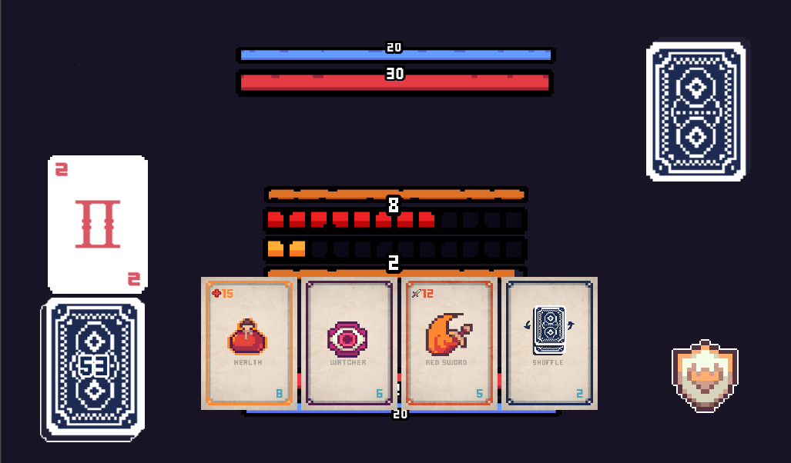

This is a NFT GAME based on blackjack multiplayer, First I try to use Unity and photon but I didn't like it so I switched to Godot with nakama multiplayer. (Godot version 3.4 only && Login via Metamask)

You can battle other players with Card NFTs with different abilities.

# Game Screenshot

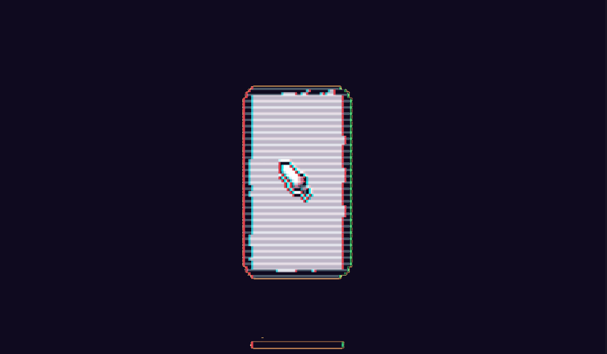
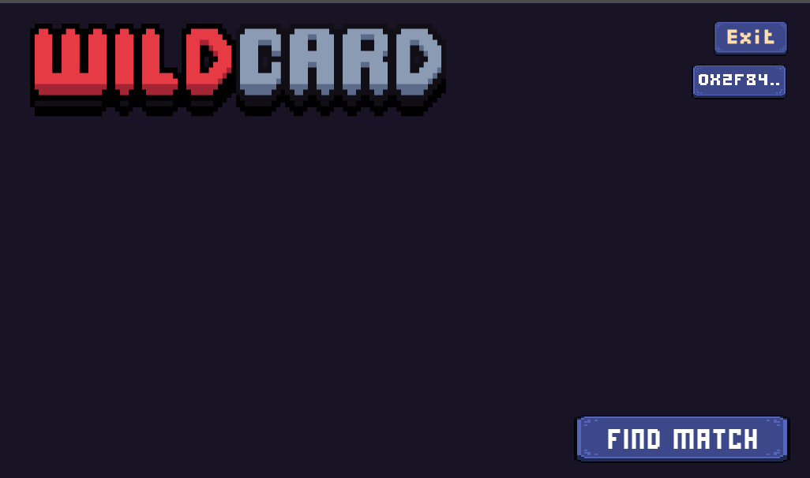

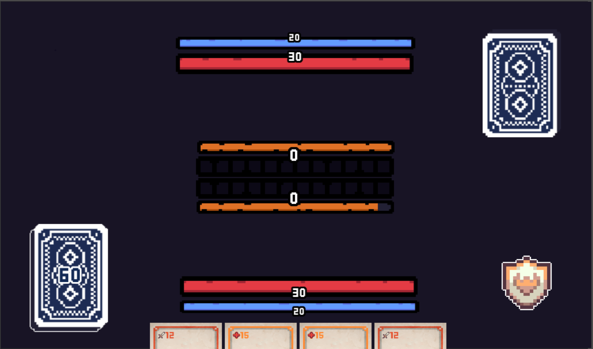

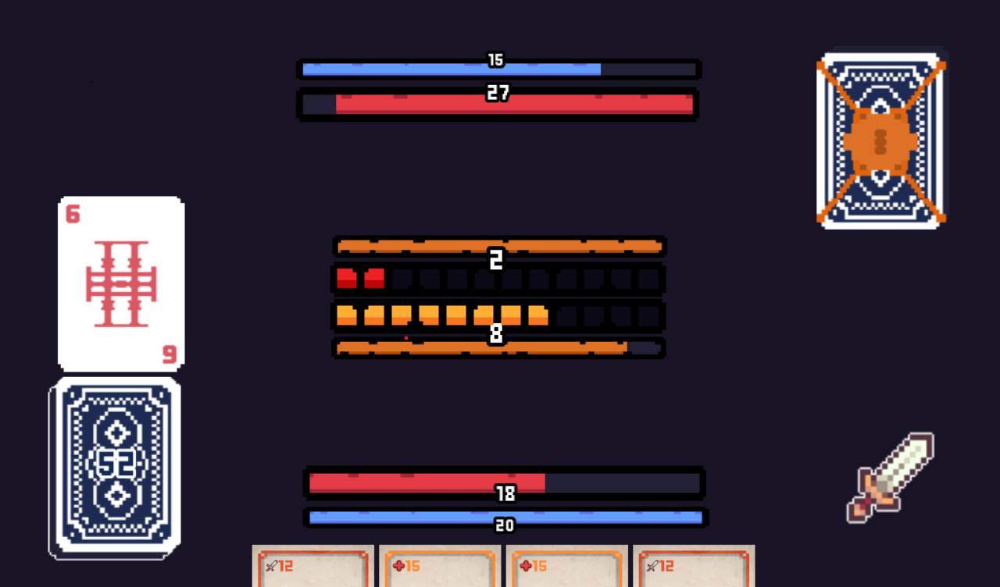

# How does my multiplayer work
Imagine me and my friend playing chess in different rooms. When I moved my checkers from d2 to d3, I told my friend to move the checkers from d2 to d3, and if my friend moved d7 to d6.
My friend will tell me again.

# DApp
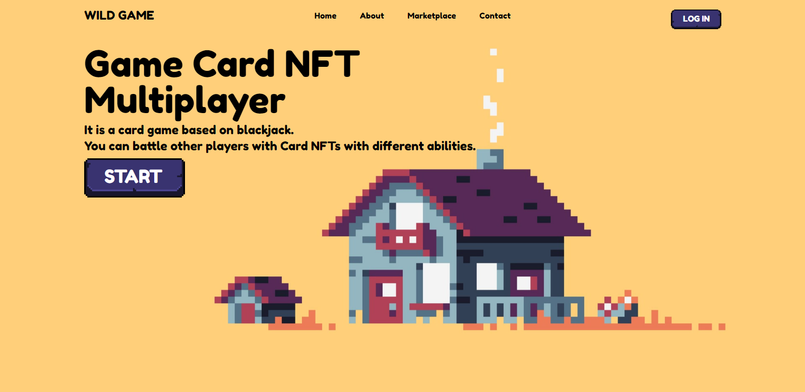
## Marketplace
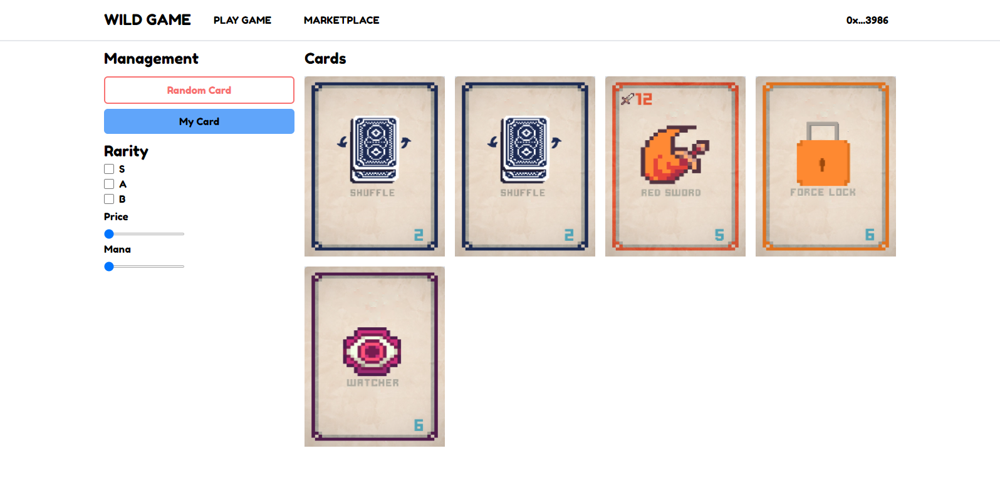
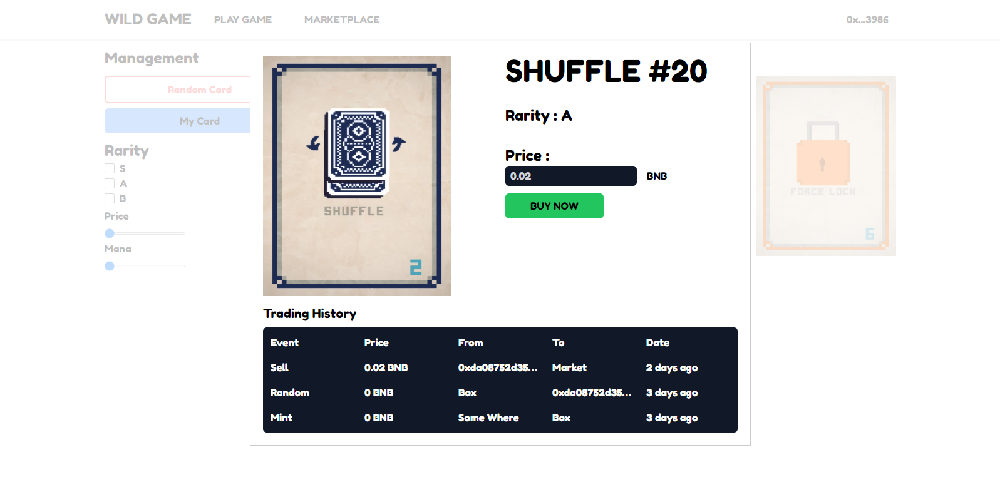
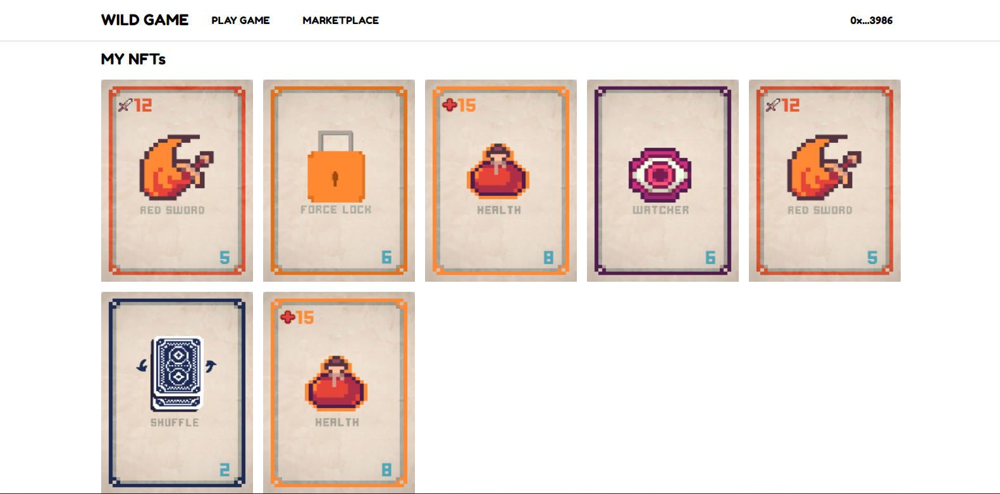
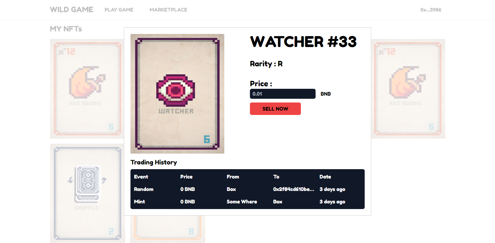
## Mint
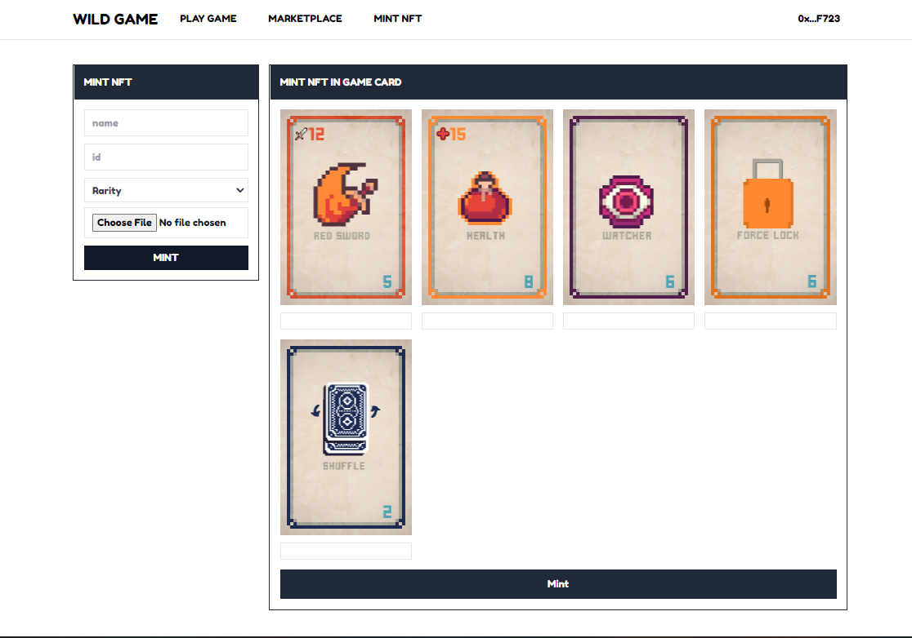

# Smart Contract
My smart contract on Binance smart chain testnet use hardhat to deploy

Example transaction
https://testnet.bscscan.com/token/0xe97bd2b6b71647f0c3517613f19f8c561b98a7e8

# How to get start
```
(Note Game)
You should get Moralis API server from moralis.io with binance testnet then open Godot(v.3.4) go to Login Screen Click Login Node You'll see Server Url and App Id from the right side change it if you not see you can open Login script and update it.

(Note Smart contract)
if you want to deploy and get you own smart contract you can do this
1. change the key at secret.json (key is Metamask private key you will get 92b99... then you just add 0x before your private key)
2. npm i
3. npm run deploy:deploy:binance

How to run
(you should have docker first)
1. docker-compose up

Dapp: localhost:3000
Game: localhost:8000
```