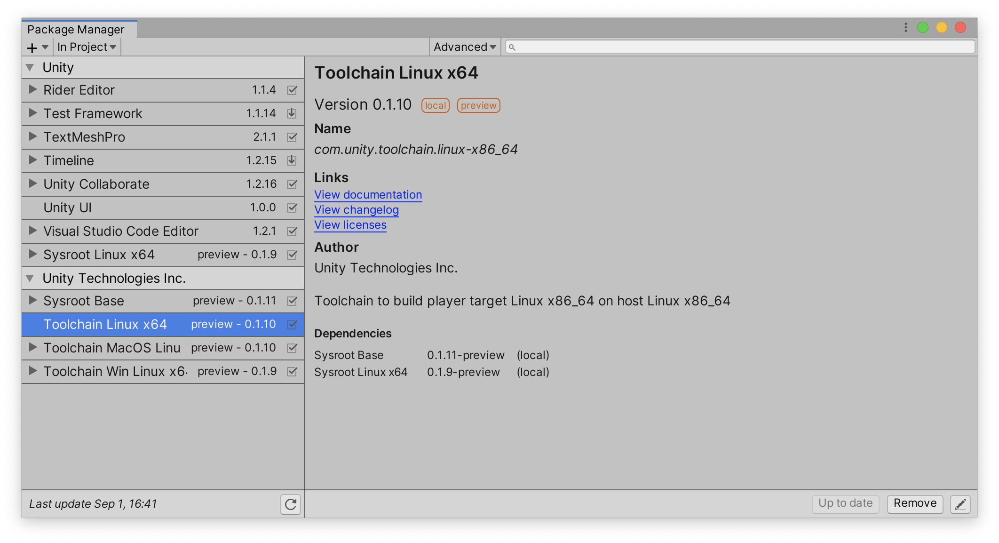
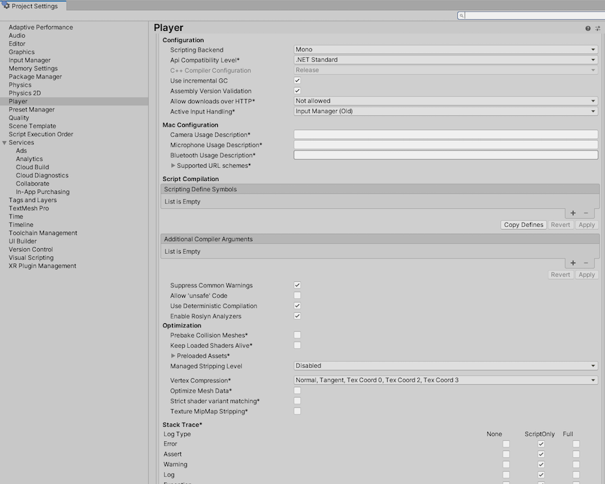

# Unity IL2CPP Build Support for Linux

Support for Linux players using IL2CPP is available from 2019.3 onwards.

Operating systems (OS) have their own build systems which vary from one another. If you build using the headers and libraries on a particular OS, this might result in the built player not running on a different one. To address this, Unity provides a sysroot to build against which works on all supported Linux platforms.

The sysroot also allows cross-compilation support which enables you to build Linux IL2CPP from Linux, macOS and Windows.

## Prerequisites

To use the following packages, you need to install the Linux Build Support (IL2CPP) module in your Unity Editor version. Use the Unity Hub to do this. For further information, see [Adding Modules to the Unity Editor](https://docs.unity3d.com/2021.2/Documentation/Manual/GettingStartedAddingEditorComponents.html).

## Unity toolchain packages

Unity provides a toolchain package, which installs the sysroot and a toolchain, for building binaries for the target. The naming convention for these packages is:

* _host platform and architecture_ 
* _target platform and architecture_

If the host platform and architecture are the same as the target platform and architecture, shorten the name to platform and architecture.

## Installing a Unity toolchain package

To install a Unity toolchain package:
1. Go to **Window** > **Package Manager**. 
2. Use the search bar to find the package, and click **Install** in the bottom right corner of the Package Manager window.  
3. Choose the package based on the host platform.

| Host    | Package                                  |
| ------- | ---------------------------------------- |
| Linux   | com.unity.toolchain.linux-x86_64         |
| macOS     | com.unity.toolchain.macos-x86_64-linux-x86_64 |
| Windows | com.unity.toolchain.windows.x86_64-linux-x86_64 |

## Using a Unity toolchain package:

When you have installed your toolchain package, go to **Project Settings** &gt; **Player** &gt; **Configuration** and set the **ScriptingBackend** to **IL2CPP**.

To build your project:
1. Go to **File** &gt; **Build Settings**.
2. In the **Target Platform** dropdown menu, select **Linux**.
3. Click **Build** or **Build and Run**.

## Technical Details

Requirements:

- Unity version 2019.4.1f1
- Linux Build Support (IL2CPP) module
